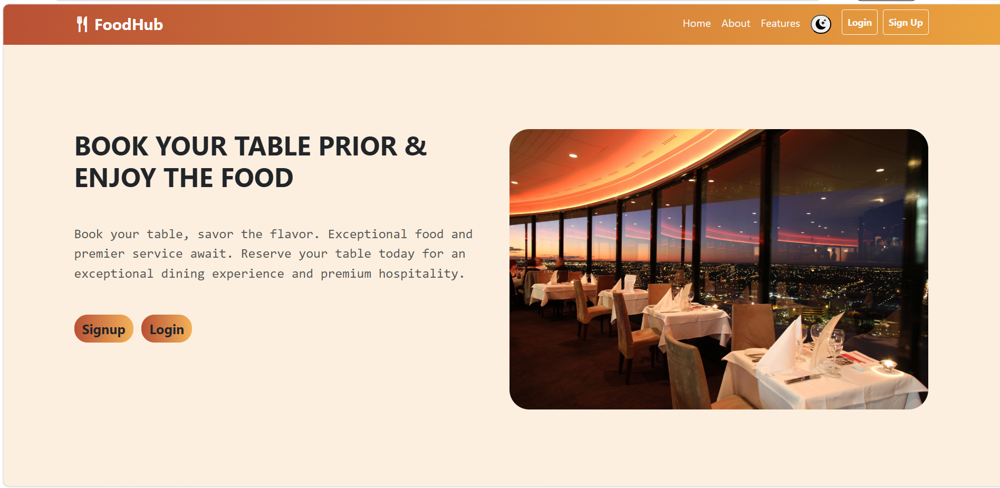

# FoodHub - Restaurant Table Reservation System

## Overview

FoodHub is a restaurant reservation web application where customers can search and reserve dining tables, while administrators manage customers, reservations, and restaurant tables through an interactive dashboard.

The project demonstrates front-end development concepts including CRUD operations, authentication, validation, pagination, searching, sorting, filtering, responsive UI and dark mode.

## Technologies Used

Technology - Purpose 
HTML5 - Web page structure
CSS - Styling and layout
Bootstrap 5 - Responsive user interface
Bootstrap Icons - Icons
JavaScript - Application logic
jQuery - DOM manipulation and event handling
SweetAlert2 - Alert and confirmation dialogs
JSON Server - REST API and data storage during development

## Application Flow

### User Flow

1. User visits the landing page.
2. New users register by creating an account.
3. Registered users log in using their credentials.
4. Based on the authenticated role:
   - Customer is redirected to the Customer Dashboard.
   - Admin is redirected to the Admin Dashboard.

### Customer Workflow

- View available tables
- Search tables using:
  - Booking Date
  - Meal Session
  - Time Slot
  - Guest Count
- Reserve available tables
- View active reservations
- Cancel reservations
- View completed reservations
- View profile information
- Logout

### Admin Workflow

- View dashboard statistics
- Manage restaurant tables
- Add new tables
- Edit existing tables
- Soft delete tables
- Restore deleted tables
- View customer details
- Manage reservations
- Search reservation records
- Filter reservations
- Sort reservations
- View paginated results

## Project Structure

FoodHub
│
├── assets
│   └── images
|             └── caurosel_images
|             └── screenshots
│
├── json
│   └── restaurant.json
│
├── pages
│   ├── index.html
│   ├── login.html
│   ├── signup.html
│   ├── admin_dashboard.html
│   └── customer_dashboard.html
│
├── scripts
│   ├── configure.js
│   ├── login.js
│   ├── signup.js
│   ├── admin_dashboard.js
│   └── customer_dashboard.js
│
├── styles
│   ├── index.css
│   ├── login.css
│   ├── signup.css
│   ├── admin_dashboard.css
│   └── customer_dashboard.css
│
├── restaurant_reservation_SQL.sql
|
└── README.md

## Dashboard Features

### Customer Dashboard

- Display user profile
- Search available tables
- Dynamic meal session and time slot selection
- Book restaurant tables
- View active reservations
- Cancel reservations
- View completed reservations
- Dashboard statistics
- Responsive card-based interface

### Admin Dashboard

#### Dashboard

- Total Customers
- Total Tables
- Total Reservations

#### Customer Management

- View customer details
- Search by customer name
- Search by email
- Search by phone number
- Pagination

#### Table Management

- Add new tables
- Edit table details
- Soft delete tables
- Restore deleted tables
- View available tables
- View deleted tables

#### Reservation Management

- View all reservations
- Search reservations by customer name, phone number, or table ID
- Filter reservations by:
  - Booking Status
  - Meal Session
  - Booking Date
- Sort reservations by:
  - Customer Name (A–Z)
  - Customer Name (Z–A)
  - Guest Count (Ascending)
  - Guest Count (Descending)
  - Latest Bookings
  - Oldest Bookings
- Pagination

## Key Functionalities

- Role-based authentication
- Registration validation
- Login validation
- CRUD operations
- Dashboard analytics
- Table reservation management
- Dynamic booking workflow
- Search functionality
- Sorting
- Filtering
- Pagination
- Soft delete and restore
- Responsive design

## Installation

### Clone the repository

git clone https://github.com/Devasree-k/Restaurant_Reservation_System

### Navigate to the project directory

cd json

### Install dependencies

npm install

### Start the JSON Server

npx json-server --watch data/db.json --port 3000

### Run the Application

Open `index.html` using Live Server in Visual Studio Code.

## Screenshot

## Conclusion

FoodHub is a complete front-end restaurant reservation system that demonstrates modern web development concepts through a practical real-world application. The project focuses on responsive design, CRUD operations, authentication, dashboard management, reservation workflows, search, filtering, sorting, and pagination.

## Author

**Devasree K**

